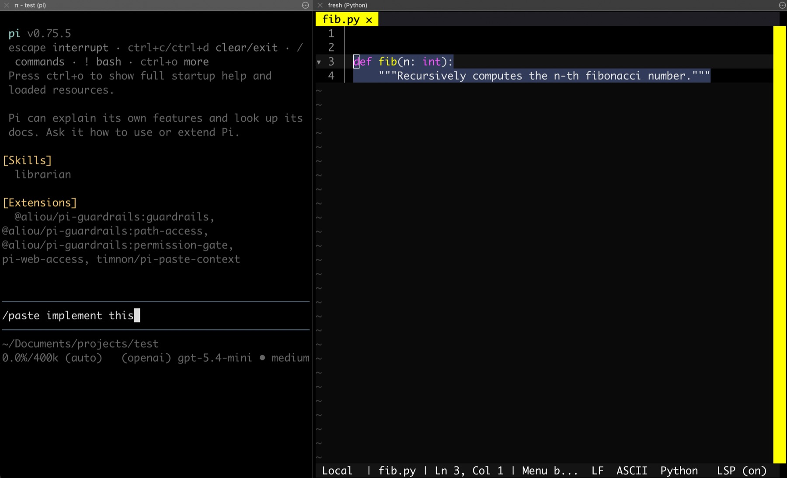

# pi-paste-context: add coding support to any editor



A pi extension to add coding support to any editor by using the clipboard (aka CTRL+C) for light integration. It searches the current project for the text in your clipboard, and then sends the matching file and snippet into the conversation as context, potentially with your instructions on top.

## What it does

- Reads your clipboard with `pbpaste`, `wl-paste`, or `xclip`
- Searches the current working directory for matching text
- Lets you choose between multiple matches when needed
- Injects a context-rich prompt so pi can explain, edit, or refactor the matched file

## Installation

### From npm

After publishing, install it from npm with:

```bash
pi install npm:pi-paste-context
```

You can also pin a version:

```bash
pi install npm:pi-paste-context@0.1.1
```

### From GitHub

For a local or unreleased checkout, install directly from the repo:

```bash
pi install git:github.com/timnon/pi-paste-context
```

You can also pin a tag or branch:

```bash
pi install git:github.com/timnon/pi-paste-context@main
pi install git:github.com/timnon/pi-paste-context@v1.0.0
```

### Local development

For a local checkout, add it to your pi settings:

```json
{
  "packages": ["/absolute/path/to/pi-paste-context"]
}
```

Or load the extension directly while testing:

```bash
pi -e ./index.ts
```

## Usage

Once installed, use the `/paste` command inside pi.

```text
/paste
/paste explain this function
/paste refactor this to use async/await
```

- If you omit arguments, it defaults to “explain this”.
- If multiple files contain the clipboard text, pi will prompt you to pick one.
- If the clipboard is empty or no match is found, the extension will notify you.

## How it works

The extension scans files in the current directory and ignores:

- `.git/`
- `node_modules/`

It also skips files larger than 2 MB and binary files.

## License

MIT
